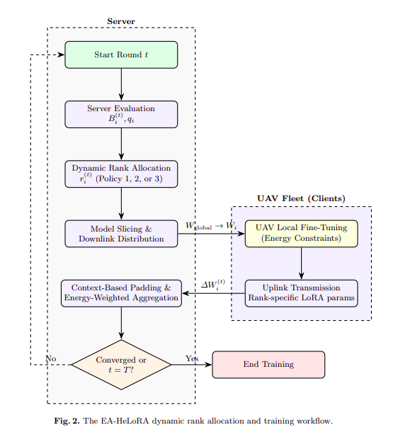
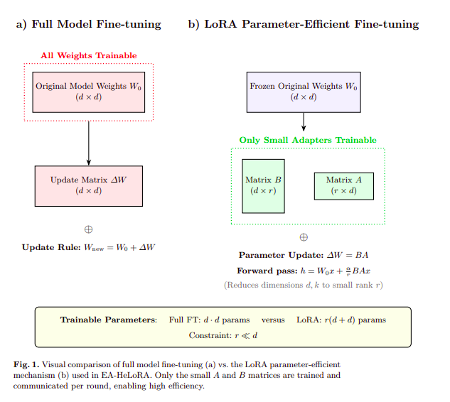
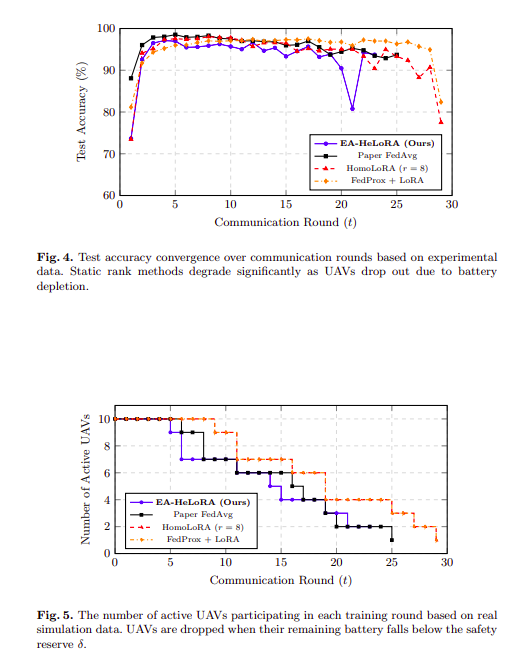

# Energy-Aware Heterogeneous LoRA for UAV-Assisted Remote Sensing

> **First and Foremost:** 
> This repository contains the implementation and experimental artifacts for our proposed **EA-HeLoRA** framework. The associated research paper is currently under submission.  
> Therefore, we provide:
> - The core simulation framework for Energy-Aware Federated Learning.
> - Model architecture configurations (ViT-base with LoRA adapters).
> - Dynamic rank allocation policies and energy consumption logs.

**Authors:** 
- Nguyen Tam Long - Computer Engineering - HCMUT
- Truong Bao Thien AN - Information Technology - HCMUS

**Advisor:** [Advisor Name]

**Note:**
- Our repository (will be made fully public after paper acceptance):https://github.com/long89kev/LoRa-Energy-Aware-UAVs

---

## 1. Overview

This project implements **EA-HeLoRA (Energy-Aware Heterogeneous LoRA)**, a federated fine-tuning framework designed for **UAV-assisted remote sensing**. 

The system addresses the critical challenge of deploying large foundation models (specifically Vision Transformers) on resource-constrained UAV fleets. Unlike standard Federated Learning (FL) which drains UAV batteries rapidly, or static LoRA methods that ignore hardware constraints, EA-HeLoRA dynamically adapts the rank of LoRA adapters based on real-time battery levels, channel quality, and data contribution.

---

## 2. Problem Motivation

Deploying deep learning on UAV fleets faces a critical "Energy-Accuracy" trilemma:
1.  **Communication Bottlenecks:** Transmitting full model parameters (e.g., 86M params for ViT-base) over aerial links is prohibitively expensive (~330 MB per round).
2.  **System Heterogeneity:** UAV fleets naturally consist of platforms with vastly different computational capabilities (Weak, Medium, Strong).
3.  **Energy Constraints:** UAVs operate on finite batteries. Standard FL methods cause UAVs to drop out mid-mission when batteries deplete, leading to catastrophic accuracy degradation.

Existing solutions like **HetLoRA** allow for different ranks but assign them statically. They fail to account for the dynamic nature of UAV battery drain during flight, leading to suboptimal resource utilization.

This raises a critical question:
> *How can we maximize model accuracy while ensuring the UAV fleet survives the mission without depleting its energy budget?*

---

## 3. Core Principle

To solve this, we treat Federated Learning as an **Energy-Optimized Resource Allocation** problem.

Instead of fixing the LoRA rank $r$, our framework dynamically adjusts $r$ at each communication round $t$. The foundation of this efficiency lies in the LoRA mechanism, which freezes the large pre-trained weights and only trains small adapter matrices:

- **High Battery & Good Channel:** The server assigns a **high rank** (e.g., $r=32$) to maximize learning capacity.
- **Low Battery:** The server downgrades the rank (e.g., $r=4$) to reduce computation/communication energy, keeping the UAV active in the federation longer.

We utilize an **Energy-Weighted Aggregation** strategy to prioritize updates from UAVs with healthy energy reserves, preventing "dying" clients from corrupting the global model.

---

## 4. Pipeline Architecture

The proposed framework operates in a closed loop between the Ground Server and the UAV Fleet:

1.  **Energy & Channel Evaluation:** UAVs report battery $B_i^{(t)}$ and channel quality $q_i$.
2.  **Dynamic Rank Allocation:** Server computes optimal rank $r_i^{(t)}$ using specific policies.
3.  **Model Slicing & Distribution:** Server slices global LoRA parameters to match assigned ranks.
4.  **Local Fine-Tuning:** UAVs train adapters locally on remote sensing data (EuroSAT).
5.  **Context-Based Padding & Aggregation:** Server aligns heterogeneous parameters and aggregates using energy weights.

---

## 5. Key Components

### Stage 1 – UAV Energy Model
We define a realistic energy consumption model for Rotary-Wing UAVs per round:
$$E_{total} = E_{comp} + E_{comm} + E_{hover}$$
- **Compute Energy ($E_{comp}$):** Proportional to LoRA rank $r$, local data size, and compute capability class.
- **Communication Energy ($E_{comm}$):** Proportional to parameter size (rank $r$) and uplink data rate.
- **Hovering Energy ($E_{hover}$):** Power required to maintain flight during the round duration.

### Stage 2 – Dynamic Rank Allocation Policies
We propose three policies evaluated in our experiments:

1.  **Energy-Greedy:** Maximizes rank while ensuring the UAV has enough energy to survive all remaining rounds.
2.  **Energy-Proportional:** Scales rank linearly with remaining battery fraction.
3.  **Channel-Aware:** Considers wireless channel quality to minimize transmission energy waste.

### Stage 3 – Context-Based Padding & Aggregation
To aggregate matrices of different dimensions (due to rank heterogeneity), we use context-based padding (padding with mean values) rather than zero-padding to preserve learned feature statistics.

The global model is updated using an **Energy-Weighted Aggregation**:
$$W_{global}^{(t)} = \frac{\sum n_i \cdot r_i \cdot e_i \cdot W_i}{\sum n_i \cdot r_i \cdot e_i}$$
where $e_i$ is the remaining energy fraction, ensuring reliable UAVs contribute more to the global model.

---

## 6. Dataset & Configuration

- **Dataset:** EuroSAT (Sentinel-2 Satellite Images). 27,000 images, 10 classes.
- **Data Heterogeneity:** Non-IID split using Dirichlet distribution ($\alpha = 0.3$).
- **Backbone:** Vision Transformer (ViT-base-patch16-224) with frozen weights.
- **LoRA Configuration:**
    - Target Modules: Query, Key, Value projections.
    - Rank Set $R = \{4, 8, 16, 32\}$.
    - Scaling factor $\alpha = 32$.
- **Fleet:** 10 UAVs (3 Strong, 4 Medium, 3 Weak) with battery capacities ranging 36–85 Wh.

---

## 7. Experimental Performance

Our framework achieves high accuracy while significantly extending fleet operational life.

### Main Results (EuroSAT, 30 Rounds)

| Method | Final Acc (%) | Total Energy (kJ) | Active UAVs @R20 | Comm Cost (MB) |
| :--- | :---: | :---: | :---: | :---: |
| **Paper FedAvg** | 93.70 | 1,135.3 | 2 | 327.33 |
| **HomoLoRA (r=8)** | 77.48 | 1,150.0 | 4 | 1.18 |
| **FedProx + LoRA** | 82.37 | 1,150.0 | 4 | 1.18 |
| **EA-HeLoRA (Ours)** | **93.74** | **900.7** | **3** | **0.87 - 6.78** |

- **Accuracy:** Matches full-model FedAvg performance (93.74%).
- **Energy Efficiency:** Reduces total fleet energy consumption by **21.7%**.
- **Communication:** Reduces cost by **376×** compared to full-model transmission.

### Policy Ablation Study
We evaluated the impact of different rank allocation strategies on UAV survival and accuracy:
- **Fixed Rank (r=8):** Rapid dropout of weak UAVs leads to convergence collapse (Final Acc: 37.67%).
- **Channel-Aware:** Achieved best balance of accuracy (79.22%) and stability.
- **Energy-Greedy:** Achieved highest energy savings (Total Energy: 883.6 kJ) by aggressively protecting battery life.

---

## 8. Contributions

This work introduces:
- A **comprehensive UAV energy model** specifically tailored for federated fine-tuning, capturing compute, communication, and hovering costs.
- **Dynamic rank allocation policies** that adapt to real-time hardware constraints (battery/channel) to prevent premature client dropout.
- An **Energy-Weighted Aggregation** mechanism that mitigates the impact of energy-depleted clients on model convergence.
- Demonstrated feasibility of **ViT models on edge UAVs** via LoRA, achieving near state-of-the-art accuracy on EuroSAT with massive communication savings.

---

## 9. Limitations & Future Work

Planned extensions for our research include:
- Integrating **physical flight controllers (PX4)** to simulate realistic wind drag and environmental factors affecting hovering energy.
- Expanding the framework to **Object Detection** tasks (e.g., DOTA dataset) for broader remote sensing applicability.
- Joint optimization of **UAV trajectory planning** and FL training to further minimize hovering energy during data collection.

---

## 10. Citation

If referencing this work, please cite the associated paper  
(currently under submission).
